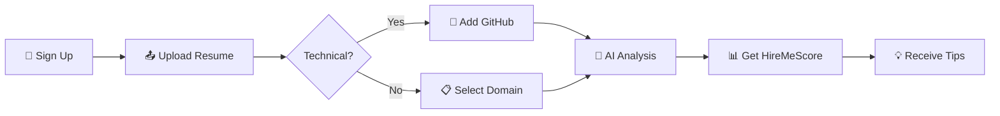

<p align="center">
  
</p>

<h1 align="center">
  
</h1>

<p align="center">
  
  
  
</p>

<div align="center">
  
</div>

## 🎯 What Makes HireMeScore DIFFERENT?

> **"Most resume analyzers treat everyone the same. We don't."**

| Traditional Analyzers | **HireMeScore** |
|----------------------|------------------|
| ❌ One-size-fits-all scoring | ✅ **Dual-mode analysis** for Technical vs Non-Technical |
| ❌ Ignores GitHub profile | ✅ **Deep GitHub integration** with project analysis |
| ❌ Fixed weightage system | ✅ **Customizable scoring** (we changed ours mid-hackathon!) |
| ❌ Boring UI | ✅ **Falling petals animation** ✨ because why not? |
| ❌ Just gives a score | ✅ **Actionable insights** with skill gap analysis |
| ❌ No personalization | ✅ **Domain-specific recommendations** |
| ❌ Static analysis | ✅ **AI-powered** with Groq API |

<div align="center">
  
</div>

## 🚀 The Problem We Solve

### 😫 **The Struggle is Real**
- You apply to 100+ jobs... crickets 🦗
- Recruiters spend **6 seconds** scanning your resume
- Generic analyzers give you a random number and call it a day
- Technical vs Non-Technical? Same score? That makes NO sense!

### 💡 **Our Solution**
<table>
  <tr>
    <td align="center" width="50%">
      <h3>🎓 For Technical Users</h3>
      <p>We analyze your:</p>
      <ul align="left">
        <li>💻 Technical Skills (30%)</li>
        <li>🧠 DSA/Problem Solving (20%)</li>
        <li>📂 GitHub Projects (15%)</li>
        <li>🎯 Experience (20%)</li>
        <li>📊 CGPA (10%)</li>
        <li>📝 Resume Quality (5%)</li>
      </ul>
    </td>
    <td align="center" width="50%">
      <h3>📋 For Non-Technical Users</h3>
      <p>We analyze your:</p>
      <ul align="left">
        <li>📚 Domain Knowledge (30%)</li>
        <li>💼 Experience (40%)</li>
        <li>🎓 CGPA (15%)</li>
        <li>📄 Resume Quality (10%)</li>
        <li>🏆 Achievements (5%)</li>
      </ul>
    </td>
  </tr>
</table>

<div align="center">
  
</div>

## 🛠️ Tech Stack - The Dream Team

| Category | Technology | Logo |
|----------|------------|------|
| **Frontend** | HTML5 + CSS3 + JavaScript |    |
| **Backend** | Node.js + Express |   |
| **Database** | MongoDB Atlas |  |
| **Authentication** | Firebase Auth |  |
| **Hosting** | Firebase Hosting |  |
| **AI/ML** | Groq API |  |
| **Version Control** | Git + GitHub |   |

<div align="center">
  
</div>

## ✨ Features That'll Make You Go "WOW!"

### 🎨 **Frontend Magic**
- 🌈 **Animated gradient backgrounds** that shift colors
- 🍃 **Falling multicolor petals** (because life's too short for boring UIs)
- 🎯 **Interactive upload area** with floating logo animations
- 📱 **Fully responsive** - works on desktop, tablet, and mobile
- ⚡ **Real-time form validation** with instant feedback

### 🔥 **Backend Beast Mode**
- 🤖 **AI-powered analysis** using Groq's Llama 3.3 model
- 🔄 **Dual-mode scoring** for technical/non-technical users
- 📊 **GitHub API integration** - analyzes your actual projects
- 🎯 **Customizable weightage** (we literally changed it during presentation!)
- 💾 **MongoDB Atlas** for scalable data storage

### 🛡️ **Security & Authentication**
- 🔐 **Firebase Authentication** - secure and reliable
- 🎫 **JWT tokens** for API security
- 🚫 **No API keys exposed** - all secrets in `.env`
- 🛡️ **Input validation** on both frontend and backend

<div align="center">
  
</div>

## 🎮 How It Works (In 3 Simple Steps)

### Step 1: Sign Up
Choose your path - Technical or Non-Technical warrior

### Step 2: Upload Your Resume
Drag & drop or click - we accept PDFs (like every job portal ever)

### Step 3: Add Your GitHub
add your github profile url

### Step 4: Get Analyzed
Our AI goes to work and returns:

✅ Your HireMeScore (0-100)

✅ Skill gaps you need to fill

✅ Improvement tips that actually make sense

✅ Domain recommendations tailored to YOU

<div align="center">
  
</div>



<div align="center">
  
</div>

### 🤝 Contributors
<p align="center">
  <a href="https://github.com/IshanVermaGT">
    
  </a>
  <a href="https://github.com/its-AmitB">
    
  </a>
  <a href="https://github.com/love371">
    
  </a>
  <a href="https://github.com/sumit-git204">
    
  </a>
</p>

## 📂 Directory Structure

```text
hiremescore/
├── frontend/
│   ├── assets/
│   │   └── images/
│   ├── css/
│   │   └── style.css
│   ├── js/
│   │   ├── auth.js
│   │   ├── dashboard.js
│   │   └── analysis.js
│   ├── pages/
│   │   ├── signup.html
│   │   ├── login.html
│   │   ├── dashboard.html
│   │   └── analysis.html
│   └── index.html
├── backend/
│   ├── config/
│   │   ├── firebase.js
│   │   └── serviceAccountKey.json  
│   ├── controllers/
│   │   ├── authController.js
│   │   └── analysisController.js
│   ├── middleware/
│   │   └── auth.js
│   ├── models/
│   │   └── User.js
│   ├── routes/
│   │   ├── auth.js
│   │   └── analysis.js
│   ├── .env                         
│   ├── package.json
│   └── server.js
└── .gitignore
```

<p align="center">Made with ❤️ and ☕ during a hackathon<br>
  
</p>
